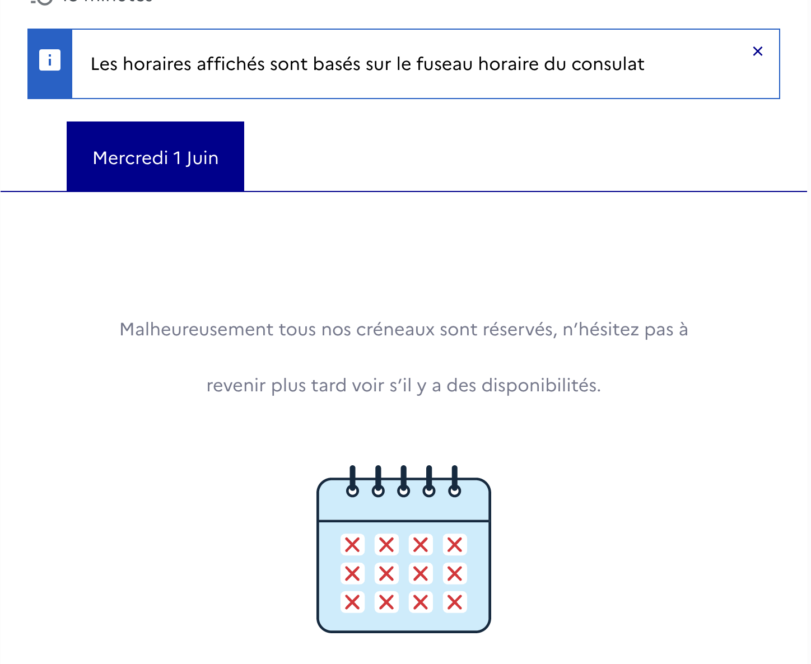
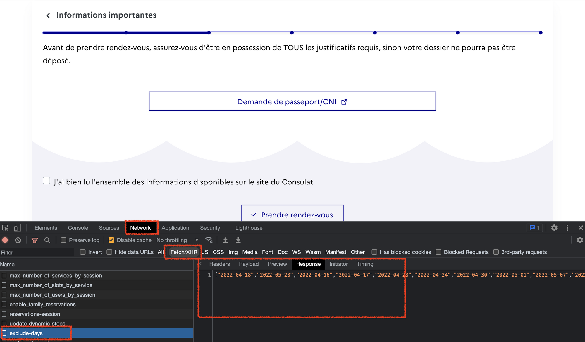
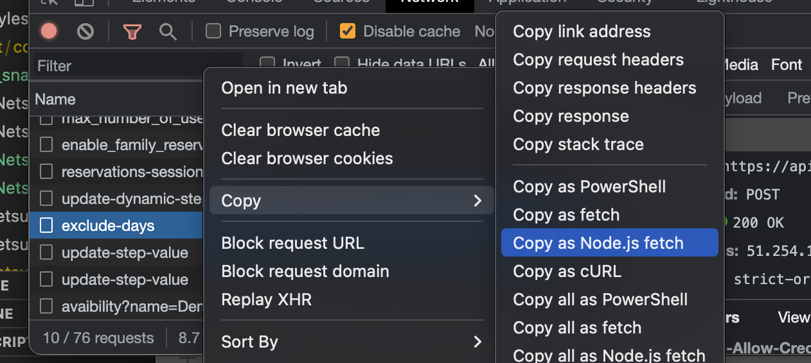
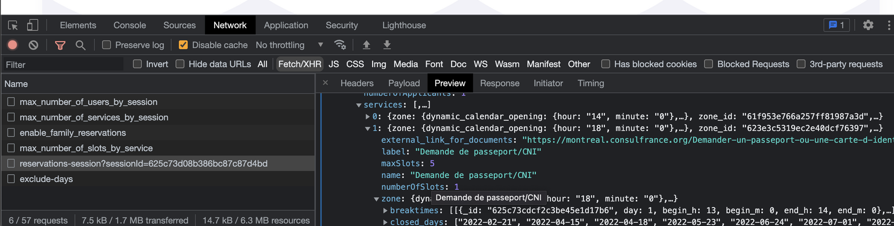

> [!WARNING] A warning
> This article have been written in early April 2022. Since the release of the bot it seems that the underlaying API have [changed a bit](https://twitter.com/_julbrs/status/1518750907248300034). I am not planning to document the modification of the bot that have been done after this initial version, but it will give a pretty good picture of the methodology used.

I am currently living in **Montréal, QC** but I am still a **French citizen**. So like thousands of French citizens living abroad, I rely on the French Consulate for a few administrative procedures, including passeport renewal. And in the last years, it has been more and more complex to book an appointment in order to renew or ask for a passeport:



No appointment available on French Montreal Consulate as of today...

So my plan was to **automate the retrieval of available appointements** in order to be able to book a slot (for my wife), and send it to **a tool where a notification system is available**, and Twitter seems a good candidate.

This article will guide you thought this process: first you will understand **how the application is working** ([this one](https://consulat.gouv.fr/consulat-general-de-france-a-montreal/rendez-vous)), then you will **build a serverless application** using [Serverless Stack](https://serverless-stack.com/) that will extract the needed information and send it to **Twitter**.

## A few word on the used tools

### The appointment application

The French Montreal Consulate is relying on a third-party application to manage the appointment system:

[Accueil - Consulat Général De France À Montréal - Rendez-vous](https://consulat.gouv.fr/consulat-general-de-france-a-montreal/rendez-vous)

There is a big **TROOV** logo on the page, and a few indicators in the source code linking to TROOV company. TROOV is providing an online appointment booking solution named \***\*TROOV TON CRÉNEAU\*\***:

[F.A.Q - Frequently asked questions](https://www.troov.com/en/faq/pro/ttcclient)

### [Serverless Stack](https://serverless-stack.com/)

I am using a lot this toolkit to build solutions that will run on an AWS account for a very low amount of $. It’s a very elegant all-in-one solution to manage **serverless** applications, you can read it more here:

- [**SST: The Most Underrated Serverless Framework You Need to Discover**](https://www.notion.so/SST-The-Most-Underrated-Serverless-Framework-You-Need-to-Discover-63cfa97d720b4199a37c42b56324234e)
- [**SST: The Most Underrated Serverless Framework You Need to Discover (part 2)**](https://www.notion.so/SST-The-Most-Underrated-Serverless-Framework-You-Need-to-Discover-part-2-23a504be199b444b9ff14e25d69bf132)
- [Why and How Migrate From Firebase to Serverless Stack?](https://www.notion.so/Why-and-How-Migrate-From-Firebase-to-Serverless-Stack-3cb91b7334b248e69914543b2fcdda45)

### Twitter

Twitter is providing an [API](https://developer.twitter.com/en/docs/twitter-api) to build bots easily. I have been inspired by the **Vaccélérateur** project here in Québec: a very simple Twitter bot that share t**he next slots for a COVID-19 vaccine shot in your area**:

[Find faster vaccine appointments in Québec 📆⏩💉](https://blog.transitapp.com/find-faster-vaccine-appointments-in-quebec-f14d36d0f7f/)

## Understand the application

The first step here is to understand if it’s possible to grab programmatically the appointment list for the Consulate. Here my best tool is the **Developer Tools** menu that you can open in any decent browser nowadays (generally with `F12`). Here is the one I have on Chrome:



Some important points:

- Let’s focus on the **Network** tab, it give you the various REST API calls done by the frontend application to the backend.
- Let’s filter on `Fetch/XHR` to have only REST calls, and don’t see images, css, and other files that are not useful now
- If I click on `exclude-days` then it give you on the left all the information regarding this specific API call. You have the headers, the payload sent to the backend, and the preview/response sent by the backend to the frontend. Here for exemple I am viewing a list of dates, sent by an endpoint called `exclude-days`. 🧐 So we can safely imagine that **this is a list of day with no availability at all**.

Another exemple:


Here the endpoint is named `avaibility` (yes, there is a typo 😅, **TROOV** is a french company 😇), and the **query string parameters** sent contains a specific date (`2022-06-01`). The result (not shown here by available on the Response tab) is **an empty array**, and this is exactly what the user is getting on the application: no slot available for June 1st.

So to resume:

- There is a few calls to the API to specify your need (I need an appointment to renew my passeport)
- Then the backend is sending the list of days where there is no spot available (`exclude-days`)
- Then the frontend is showing all days not in this list (and maybe excluding Saturday, Sunday, not worked days)
- For each day a query is sent to list the time of the days where you can book your appointment

## Mimic via code the process

Then my approach was to try to code this manual process. Again Developers Tools are good help here, because you can directly copy an API call to the desired output:



Here I can easily copy the call to a **Node.js fetch** command. It’s also possible to get a **cURL** command line (to paste in your terminal for example), but my goal was to build a small script so Node is a good option here.

[Node fetch](https://www.npmjs.com/package/node-fetch) is equivalent of the fetch command available in the browser. In a new folder do the following:

- import the node fetch dependency: `npm install node-fetch@2`
- create a new file `test.js` where you paste the **Copy > Copy as Node.js fetch** result, encapsulated in an async method (see below for the code)
- run it with `node test.js`:


<aside> 👉 That a first win! It’s possible to call programmatically the endpoint to retrieve some useful information!!

</aside>

Here is the used code for reference. It will not work on your side without modification as there is a **session id** provided in the body (that will be probably expired by the time you will run it!)

```jsx
const fetch = require("node-fetch");

const app = async () => {
  const response = await fetch(
    "<https://api.consulat.gouv.fr/api/team/61f924e90b0582a933ff3e7c/reservations/exclude-days>",
    {
      headers: {
        accept: "application/json, text/plain, */*",
        "accept-language": "en-US,en;q=0.9,fr;q=0.8",
        "cache-control": "no-cache",
        "content-type": "application/json",
        pragma: "no-cache",
        "sec-ch-ua": '" Not A;Brand";v="99", "Chromium";v="100", "Google Chrome";v="100"',
        "sec-ch-ua-mobile": "?0",
        "sec-ch-ua-platform": '"macOS"',
        "sec-fetch-dest": "empty",
        "sec-fetch-mode": "cors",
        "sec-fetch-site": "same-site",
        "x-troov-web": "com.troov.web",
        Referer: "<https://consulat.gouv.fr/>",
        "Referrer-Policy": "strict-origin-when-cross-origin",
      },
      body: '{"start":"2022-04-17T09:12:37","end":"2022-06-01T09:12:37","session":{"623e3c5319ec2e40dcf76397":1}}',
      method: "POST",
    }
  );
  const json = await response.json();

  console.log(json);
};

app();
```

This first win 🏆 might seems easy but there is some challenges to deal with:

- What is the `61f924e90b0582a933ff3e7c` value in the API url? Seems to be an identification of the Consulate!
- How to build the `start` and `end` date in the body? It seems to correspond to a 45 days duration, because the French Montreal consulate is allowing to book only in the next 45 days.
- What is the value in body behind session ? (`623e3c5319ec2e40dcf76397` here) ? If you put a random value or no value at all the API is not providing you the desired list!

## Some challenges

### Team Id and Zone Id

When investigating the `reservations-sessions` endpoint, I found that the endpoint is sending back a lot of information with the detail of each service (`zones`) available in the Consulate:



Actually I am just extracting the needed information:

- `team_id`
- `zone_id`
- `name`
- `dynamic_calendar.end.value` (this is the `45` value I need!)

All this information will be used for next challenges.

<aside> 👉 It’s not ideal, as if the data is changed (let’s say it’s extended to 60 days instead of 45 days) then I need to manually modifying the configuration. But as of today, I have **not found** a public endpoint with the configuration of each `zone`.

</aside>

### Start and end date

Based on that it’s easy to mimic the call:

```jsx
export const extractExcludeDays = async (start: Date, end: Date, consulateZone: ConsulateZone) => {
  const response = await fetch(`${API}/${consulateZone.teamId}/reservations/exclude-days`, {
    headers: {
      "content-type": "application/json",
    },
    body: JSON.stringify({
      start: isoLocale(start),
      end: isoLocale(end),
      session: { [consulateZone.zoneId]: 1 },
    }),
    method: "POST",
  });
  return response.json();
};
```

The `isoLocale` is a simple function to format the date in the expected format.

### Session challenge

I have tried to generate a session, as it will be needed for some calls . I have found the endpoint `reservations-session` that provide me a `_id` value that act as a session id. I just need to call this endpoint before any other calls:

```jsx
export const startSession = async (consulateZone: ConsulateZone) => {
  const session = await fetch(`${API}/${consulateZone.teamId}/reservations-session`, {
    body: null,
    method: "POST",
  });
  return session.json();
};
```

## Wrapping everything in [Serverless Stack](https://serverless-stack.com/)

This is the fun 🤩 part! After bootstrapping a new project ([see here](https://docs.serverless-stack.com/installation)), I have chosen to rely on a [Cron](https://docs.serverless-stack.com/constructs/Cron) construct to run my script. It will handle behind the scene a simple AWS Lambda function, triggered on a specific schedule. That’s all I need!

The configuration is the following:

```jsx
new Cron(this, "Cron", {
  schedule: "rate(5 minutes)",
  job: {
    handler: "src/cron.main",
    timeout: 10,
    environment: { TABLE: table.tableName },
    permissions: [table],
  },
  eventsRule: {
    // disable cron schedule if deployed locally
    enabled: !scope.local,
  },
});
```

It’s running every 5 minutes actually, I hope it’s enough!

I am also using a [Table](https://docs.serverless-stack.com/constructs/Table) construct in order to store the configuration for the various consulate.

As always it’s a really pleasant moment to develop using this stack, thanks to the [Live Lambda Development](https://docs.serverless-stack.com/live-lambda-development) feature!

## Running multiple check at once

Once everything is stored correctly in a DynamoDB table, it’s simple to run the same script for multiple Consulate:

```jsx
const consulateZones = await ddbClient.send(new ScanCommand(params));
  return Promise.all(
    // @ts-ignore
    consulateZones.Items?.map(async (dynamoConsulateZone) => {
      const consulateZone = unmarshall(dynamoConsulateZone) as ConsulateZone;
      if (consulateZone.active) {
        return {
          consulate: consulateZone.consulateName,
          result: await checkSingleZone(consulateZone),
        };
      } else {
        return {
          consulate: consulateZone.consulateName,
          result: "inactive",
        };
      }
    })
  );
```

## Sending the information to a Twitter account

After asking to create for a new [Twitter Developer Account](https://developer.twitter.com/en/apply-for-access), you will be able to create an application. In my case I have used the **OAuth 1.0 authentification system** and I am using [twurl](https://github.com/twitter/twurl) in order to generate the token and token secret:

```jsx
twurl authorize --consumer-key CONSUMER_KEY       \\
                --consumer-secret CONSUMER_SECRET
```

And then you can retrieve the information directly in the `.twurlrc` file.

In my code, I have selected the `twitter-api-v2` library ([here](https://www.npmjs.com/package/twitter-api-v2)), which is really straight-forward to use:

```jsx
import { TwitterApi } from "twitter-api-v2";
import { ConsulateZone } from "./types";

export const postTweet = (consulateZone: ConsulateZone, text: string) => {
  const client = new TwitterApi({
    appKey: process.env.TWITTER_CONSUMER_KEY!,
    appSecret: process.env.TWITTER_CONSUMER_SECRET!,
    accessToken: consulateZone.twitterOauthToken,
    accessSecret: consulateZone.twitterOauthTokenSecret,
  });
  return client.v1.tweet(text);
};
```

## Wrapping up

As of today there is 3 Twitter accounts set up to help you renew your French passeport:

- [https://twitter.com/RdvConsulat_Mtl](https://twitter.com/RdvConsulat_Mtl) for Montréal French Consulate
- [https://twitter.com/RdvConsulat_Lon](https://twitter.com/RdvConsulat_Lon) for London French Consulate
- [https://twitter.com/RdvConsulat_NY](https://twitter.com/RdvConsulat_NY) for New-York French Consulate

And a tweet is created on the corresponding account each time a new slot is found:


The operational cost of the whole infrastructure is negligible (still showing _0.00 USD_ after a few days 🤑, probably still in the free tiers of Lambda and API Gateway usage...), It’s highly redondant and there is no server to manage or update...

> [!NOTE] To conclude
> 💡 Thanks for your time reading this article! You can discuss with me [here](https://twitter.com/_julbrs). Let me know if you have any question or suggestion on this project!

Links:

- [[Mon RDV au Consulat]]
