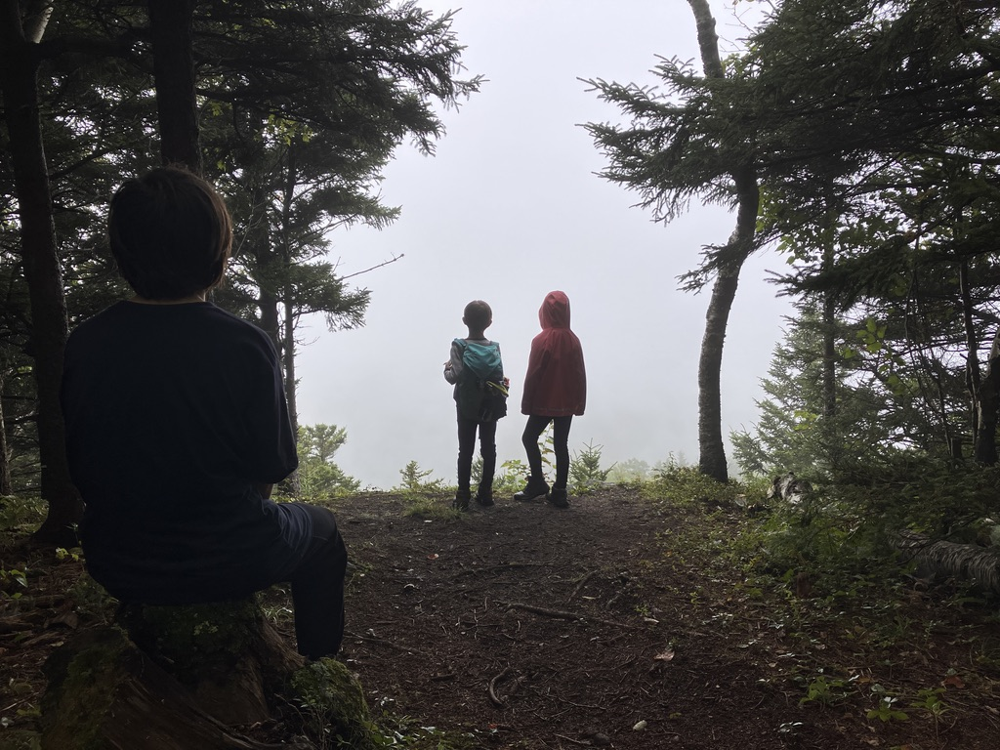
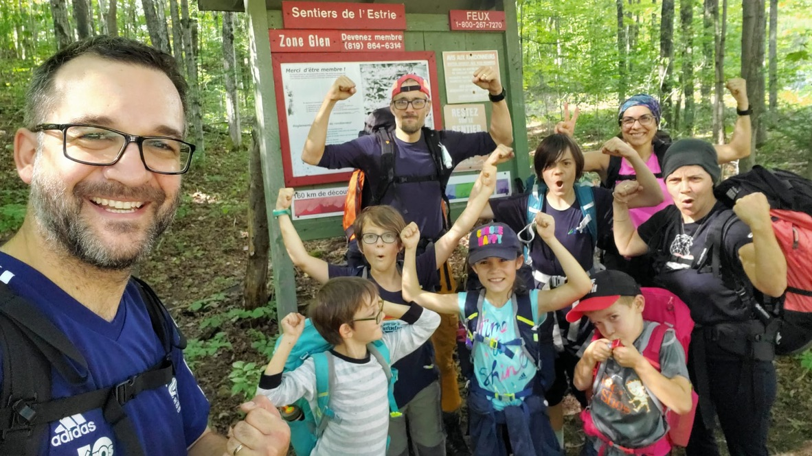

**Randonnée itinérante du 26 au 27 août 2023 dans les Montagnes Vertes au Québec.**

> J'avais promis aux enfants de faire une sortie en bivouac cette année, et notre nouveau terrain de jeu autour de Sherbrooke est plutôt propice pour ce genre d'activité.

## La genèse

On est membre des [sentiers de l'Estrie](https://www.lessentiersdelestrie.qc.ca/) depuis bientôt 1 an, et je découvre la section _[camping rustique](https://www.lessentiersdelestrie.qc.ca/documents/camping.pdf)_ ces dernières semaines. A côté de cela, je tombe sur les produits "[Prêt-à-partir](https://www.randoquebec.ca/pret-a-partir/)" produit par Rando Québec. C'est un document qui rassemble toutes les informations importantes et la cartographie pour une série de randonnée au Québec. En particulier je trouve la [Traversée des Montagnes Vertes](https://baliseqc.ca/3S/explorer/cantons-de-lest/les-sentiers-de-lestrie-LR0340?cdres=LR0340&lat=45.12629999999999&lng=-72.50559999999999&zoom=12) intéressante, et je me dis que ça pourrait être une bonne idée pour une première sortie en bivouac, en gardant que la partie du Mont Glen en aller-retour.

Dans ma préparation j'ai pu aussi m'appuyer sur le blog **Derrière l'horizon** qui a fait une sortie documentée l'an passée: https://derrierelhorizon.home.blog/2022/06/09/la-traversee-des-montagnes-vertes/. On y retrouve par exemple des photos des emplacements de camping rustique au ruisseau Ives.

## Première journée

**Statistiques: 10 km, 5h31, 700m D+**

On arrive avec nos amis au parking [S07 des Sentiers de l'Estrie](https://www.google.ca/maps?daddr=45.1614181,-72.3859099) vers 10h30 le samedi, Après une très courte section sur la route, on rentre sur le sentier coté Nord. Le temps est relativement clément avec seulement un épisode pluvieux après notre rapide lunch.

On a la chance de pouvoir ensuite admirer la passe de Bolton depuis plusieurs points de vues successifs. A la fin de la journée, on arrive enfin au sommet du Mont Glen et on en profite pour admirer le paysage environnant. On reconnaît assez facilement le lac Brome, le Mont Orford!

Ensuite on fait une courte descente d'environ 20 minutes pour arriver au ruisseau Ives, où on va passer la nuit. L'installation est composé de 4 plateformes en bois, une toilette sèche, un emplacement pour lever la nourriture à l'abri des rongeurs. On a aussi un accès à l'eau du ruisseau, mais il faut prévoir de la traiter avant de la boire. On arrive vers 17h, soit une belle journée de marche pour les enfants.

Le campement est installé rapidement, et on prépare ensuite notre souper, composé de soupes et des pates à cuisson rapide. Un grand succès!

## Deuxième journée

**Statistiques: 10.3 km, 4h55, 400m D+**

Pour l'itinéraire du jour 2, j'avais prévu deux options. La première, plus ambitieuse passait par le site du camping Westfield, de l'autre coté de la passe de Bolton, tel que décrit dans l'itinéraire prêt-à-partir. La deuxième option était de revenir sur nos pas, et de prendre le sentier des crêtes pour revenir au parking. On a finalement opté pour la deuxième option, car on avait un peu peur de la longueur de la première option (4 km de plus environ).

On a donc pu revoir à nouveau tous les points de vue de la veille, avec un temps plus blanc!

Cette journée était moins exigeante que la veille (moins de dénivelé!), et on a pu arriver au parking vers 16h00.

## Les sacs

Le défi pour une telle sortie est de garder du plaisir avec un gros sac sur le dos, donc on doit limiter au maximum le poids de ce sac. Voici la composition approximative des différents membres de la famille:

- **Julien**: une tente 3 places, le duvet de Marcus (encombrant), 2 tapis de sol, réchaud, bouffe dans un gros sac 60l
- **Marion**: une tente 2 places, duvet+tapis de sol, bouffe dans un gros sac 50l
- **Sidonie et Eliott**: chacun leur duvet, tapis de sol et collations dans des sacs entre 30 et 40l
- **Marcus**: duvet Julien (tout petit, rentrait dans son sac!) dans son sac 18l

En plus de cela quelques vêtements de rechange, une couche chaude et une couche imperméable.

## Conclusion

On a été étonné de la capacité des enfants à marcher sans broncher 2 jours d'affilé, pendant 5h de temps. Le fait de partir avec des amis a sans doute joué très positivement sur les enfants (et sur nous!). Cela nous a conforté dans notre idée d'organiser une sortie plus longue l'an prochain, pourquoi pas sur la [Long Trail](https://www.greenmountainclub.org/the-long-trail/) au Vermont? A suivre!

Les traces sur Strava:

- [Jour 1](https://www.strava.com/activities/9732855674)
- [Jour 2](https://www.strava.com/activities/9733122910)
