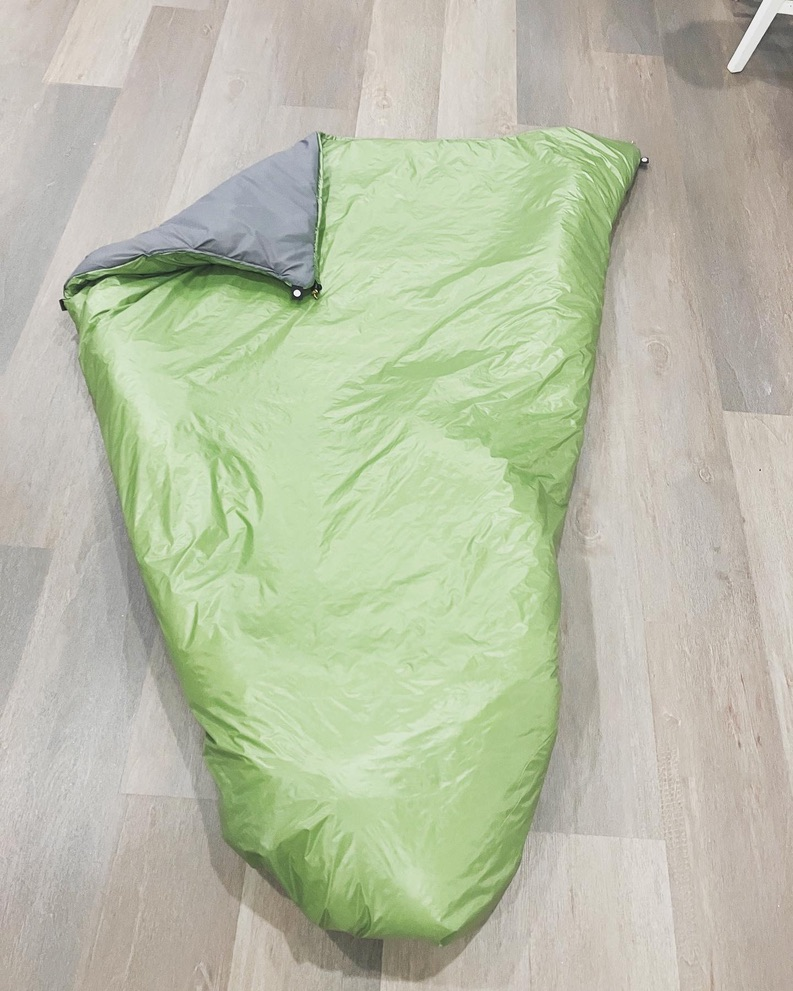

Les enfants grandissent, et les sacs de couchage doivent suivre! Rendue à 10 ans, Sidonie a besoin d'un sac de couchage plus grand, et j'ai commencé à magasiner pour un sac de couchage 3 saisons. Vu que je souhaite faire plus de bivouac avec les enfants dans les années à venir, je voulais m'orienter vers un quilt pour optimiser le poids et le volume du sac. Sidonie était partante pour dormir dans un quilt comme papa! Le soucis c'est qu'il y a peu d'offres sur les quilts au Canada et je ne voulais pas tenter un achat aux USA avec les frais de douane et de transport. J'ai donc décidé de me lancer dans la confection d'un quilt pour Sidonie.

## Choix de l'isolant

Je suis parti assez rapidement sur un isolant synthétique pour plusieurs raisons:

- c'est plus tolérant à l'humidité que le duvet. Sidonie fait des camps avec son groupe scouts, et je préfère qu'elle puisse utiliser son quilt dans toutes les conditions, sans craindre l'humidité.
- c'est beaucoup plus simple comme projet #MYOG: il n'y a pas de couture complexe à faire pour éviter les ponts thermiques, car une seule couture à l'extérieur du quilt suffit à maintenir l'isolant en place.

## Patron

Je me suis inspiré de deux projets disponibles sur internet. Tout d'abord un projet qui présente un quilt pour enfant: https://www.stitchbackgear.com/articles/make-ultralight-backpacking-quilt. J'ai récupéré de ce projet le concept des Kam snaps (que ma blonde avait en stock!).
Je me suis aussi inspiré du site suivant: https://backcountrybanter.com/how-to-build-a-synthetic-top-quilt-diy-myog/ qui présente un quilt pour adulte. Le patron est disponible sur le site, et j'ai pu l'adapter pour coller au mieux à la taille de ma fille, en gardant de la marge pour qu'elle puisse l'utiliser plusieurs années.

C'est pas super évident de choisir les différentes dimensions! Je me suis aussi appuyé sur mon propre quilt (une couette Yeti CSC M350 issue d'un projet sur [Randonner-leger](https://www.randonner-leger.org/forum/viewtopic.php?id=18974)!). Bref je me suis rendu compte que ma couette était sans doute un peu étroite pour moi!

## Matériaux

La meilleure place sur ce bord de l'atlantique pour trouver le tissu et l'isolant est une boutique américaine: https://ripstopbytheroll.com/. Il y a un choix monstrueux de tissus, isolants, accessoires, etc. Le soucis c'est que c'est au USA et donc pour nous canadiens ca veut dire frais de transport et frais de douanes. J'ai donc préféré m’appuyer sur une boutique canadienne au Manitoba: https://hofmanoutdoorgearsupply.ca/. Il y a toujours des frais de transport, mais pas de douanes! J'ai donc commandé les matériaux suivants:

- 2 yards de tissu 1.1oz calendared ripstop nylon (un beau vert pour l'extérieur)
- 2 yards de tissu 1.6oz hyperD ripstop nylon (gris pour l'intérieur)
- 2 yards d'isolant Apex Climashield 6oz (il est vendu pour permettre un utilisation jusqu'à -5°C, mais je pense que c'est un peu optimiste, je vise plutôt 0°C)
- un peu de gros grain pour les sangles et du fil pour coudre tout ça!

Le choix du tissu est pas si évident non plus, je suis parti sur un tissu léger (1.1 oz = 1.1 oz par yard carré). La largeur du tissu est toujours d'environ 60 pouces, donc j'ai optimisé pour ne pas avoir trop de chutes. Au final le tissu vert que j'ai imaginé pour l'intérieur nous semblait plus chouette à l’extérieur, donc on a inversé les tissus! Mais comme c'est un quilt on peut switcher facilement!

J'en ai eu pour un 115 $CAD avec les frais de transports, ce qui n'est pas très élevé quand on regarde le prix d'un quilt en apex sur le marché: https://enlightenedequipment.com/revelation-apex !

## Réalisation

Le plus long consiste à bien découper et positionner les différents tissus. On positionne l'isolant, le tissu extérieur puis le tissu intérieur avec les faces externes collés.Il faut aussi prévoir de positionner les sangles de gros grain pour pouvoir les coudre en même temps que les tissus, et aussi les pièces de tissus qui vont permettre de faire passer une cordelette en haut et en bas du quilt. Ensuite la couture en tant que tel prend juste entre une et deux heures en fonction de la performance de l'opérateur! Bien penser de garder un pied non cousu pour pouvoir retourner le quilt et finir la couture. C'est très bien expliqué sur les 2 liens que j'ai mis plus haut, il y a également beaucoup de vidéo sur Youtube qui explique le processus.

Je suis pas mal satisfait du produit fini à date! Il reste à tester en situation réelle, mais je pense que ça va être un bon produit pour les sorties en bivouac avec les enfants! Le poids final du produit est de 750g, ce qui est pas mal du tout!

Prochain projet: faire un sac de compression pour ranger le quilt! Pas évident non plus d'anticiper le volume nécessaire pour le quilt compressé!
