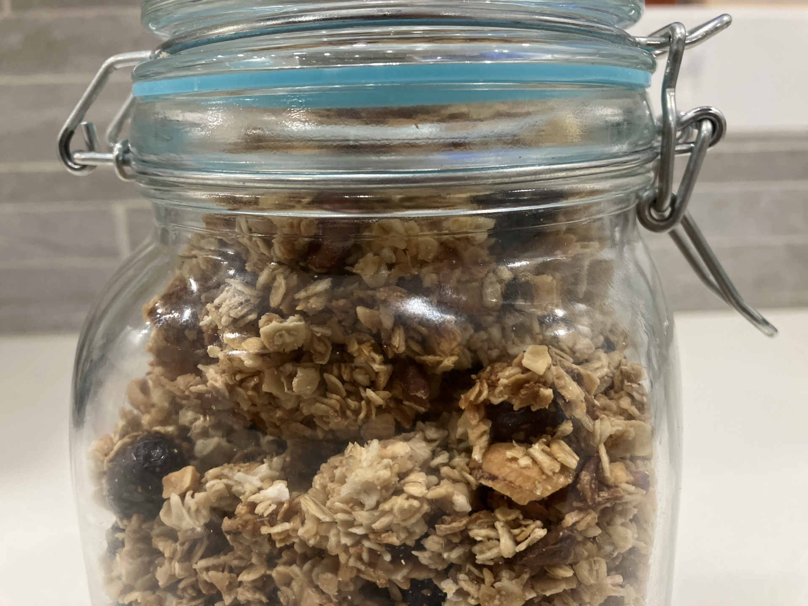

## Ingrédients

**Pour 2 portions.**

- ¾ tasse de flocons d'avoine
- ½ tasse de noix de pécan crues, hachées
- ¼ tasse de noix de coco non sucrée, râpée ou en lamelles
- ¼ tasse de canneberges séchées
- ¼ tasse de sirop d'érable
- 1 cuillère à soupe d'huile (de pépins de raisin ou de coco)
- ⅛ cuillère à café de sel
- 1 cuillère à soupe de lait en poudre

## Préparation

### À la maison

Préchauffer le four à 165°C (325°F).

Dans un bol, mélanger tous les ingrédients sauf le lait en poudre jusqu'à obtenir un mélange homogène. Étaler le mélange sur une plaque de cuisson recouverte de papier sulfurisé. Le mélange doit être assez compact pour former des morceaux - utilisez seulement environ 1/3 de la plaque standard.

Cuire pendant 20-25 minutes, en tournant la plaque à mi-cuisson (sans mélanger le granola) pour une cuisson uniforme. Une fois le granola doré, retirer du four et laisser refroidir complètement. Briser le granola en petits morceaux et répartir le granola dans deux sacs refermables et ajouter 1 cuillère à soupe de lait en poudre dans chaque sac.

### En randonnée

Ajouter de l'eau (environ 80 ml ou 3 oz), remuer pour mélanger avec le lait en poudre. Déguster !

> [!NOTE]
> C'est devenu un classique chez nous, même en dehors ds sorties en randonnées. Je le prépare généralement en multipliant les quantités par 5, cela dure environ 10 jours à la maison!
