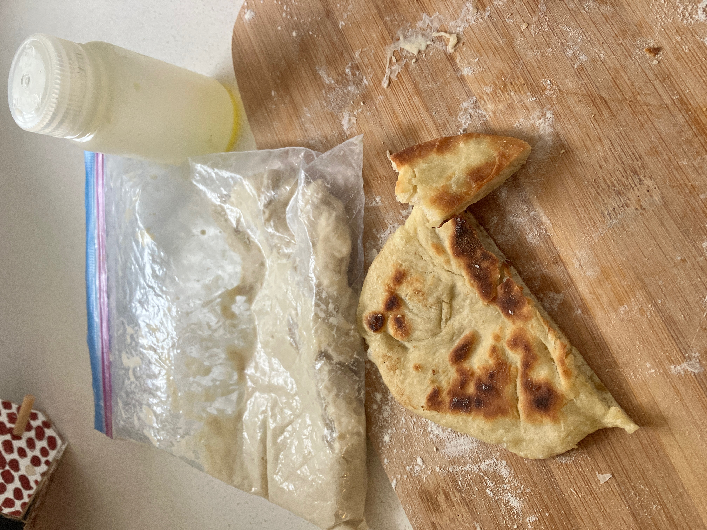

> [!NOTE]
> Il est conseillé pour cette recette d'avoir un peu d'équipement spécifique:
>
> - ziplocs
> - petits contenants pour mesurer l'eau et transporter l'huile
> - doses unitaire de sel et de levure

## Ingrédients

**Pour 2 "buns".**

- 100g de farine tout usage
- 74 grammes d'eau (74%) (le petit contenant de 90ml presque plein)
- 6 grammes d'huile d'olive (6%) mesurés dans le petit contenant
- 2,4 grammes de sel (2,4%) selon votre goût, adapté aux sachets de sel que j'ai achetés, mais typiquement le pain prend 1-4% de sel
- 3 grammes de levure sèche (3%) généralement plus du triple de ce que j'ajouterais pour une cuisson à la maison
- Un sac de farine "de réserve", que vous pouvez utiliser pour fariner vos mains et la planche à découper

## Préparation à la maison

1. Répartir des doses de 100g de farine dans un ou plusieurs ziploc

2. Mettre la quantité d'huile nécessaire dans un petit récipient (j'ai par exemple des récipients Nalgène de 2 oz ou 4 oz.)

## Préparation en randonnée

1. Dans un sac Ziploc, mélangez la farine, l'huile d'olive et l'eau. Fermez le sac en vous assurant qu'il contient beaucoup d'air et pétrissez jusqu'à ce que les ingrédients soient incorporés (ne vous inquiétez pas, une fois mélangée, la pâte ne collera pas au sac). Laissez reposer le mélange pendant 20 minutes, cette étape s'appelle "autolyse" et aidera au développement du gluten.

2. Ajoutez le sel et "incorporez-le à la pâte" en massant le sac Ziploc.

3. Répétez la même étape avec la levure.

4. "Pétrissez" la pâte en massant vigoureusement le sac jusqu'à ce qu'elle paraisse uniforme et souple, et qu'elle ne colle plus au sac.

5. Laissez la pâte lever. L'idéal est de laisser reposer toute la nuit, mais cela fonctionne aussi si vous placez le sac en haut de votre sac à dos pendant que vous randonnez et que le soleil le réchauffe, cela aide au processus de fermentation.

6. Quand vous êtes prêt (tôt le matin ou après la randonnée), nettoyez vos mains du mieux possible et farinez-les, ainsi que la petite planche à découper.

7. Retournez le sac contenant la pâte et faites-la tomber sur la planche. Divisez-la en 2 et façonnez 2 boules.

8. Étalez les 2 boules pour qu'elles s'adaptent au fond de votre casserole de camping.

9. Laissez lever pendant 20 à 30 minutes (étape facultative)

10. Faites chauffer un peu d'huile d'olive sur votre réchaud de camping et, à feu doux, faites cuire 1 côté du pain pendant 3 minutes.

11. Retournez le pain et faites-le cuire encore 3 minutes.

12. Retirez du feu, laissez refroidir et répétez à partir de l'étape 10 avec l'autre pain.

> [!NOTE]
> C'est tout simple et tellement délicieux! On fait ces petits pains à la maison aussi quand on prépare des plats indiens tels que du poulet au beurre. J'imagine que l'on peut préparer les sacs en avance avec farine + sel + levure afin de gagner du temps lors de la préparation en randonnée, même si on pert un peu en "autolyse".
