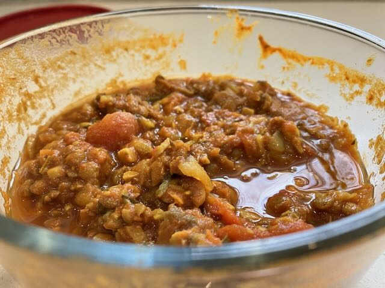
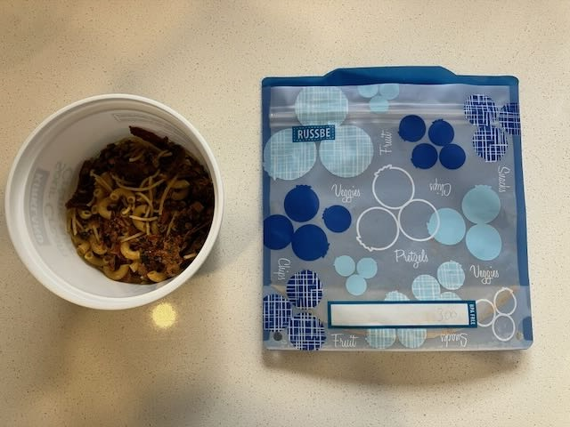

> [!NOTE]
> C'est une adaptation de la recette originale que j'ai trouvé sur le blog [Derrière l'horizon](https://derrierelhorizon.home.blog). Il y a plein d'autres recettes pour la randonnée sur ce blog ; je vous conseille d'aller y faire un tour!

## Ingrédients pour la sauce

- environ 15g de champignons déshydratés (j'en trouve au Costco)
- 2/3 tasse de vin rouge (je fais avec de l'eau quand j'ai pas de vin ouvert!)
- 2 c. à table d’huile d’olive
- 2 oignons, hachés
- 1 gousses d’ail, hachée
- 2 branches de céleri, hachées
- environ 500g de champignons blancs ou créminis, hachés
- 2 carottes râpées
- 1 courgette râpée
- 1 tasse de lentilles brunes ou vertes sèches
- 1 boîte (156 ml) de pâte de tomate
- 1 boîte (796 ml) de tomates en dés
- 1 boîte (380 ml) sauce tomate
- 1 c. à soupe de poudre de chili
- 2 c. à soupe de poudre de cari
- origan au goût
- basilic au goût
- 1 c. à café de sambal oelek
- sel et poivre du moulin au goût

## Préparation de la sauce

- Cuire les lentilles pendant 25-30 minutes dans 3 tasses d’eau. Bien rincer et égoutter, réserver.
- Réhydrater les champignons sauvages dans le vin rouge ou l'eau pendant un minimum de 15 minutes. Hacher les champignons (conserver le liquide pour l’étape 4), puis réserver.
- Dans une grande casserole, chauffer l’huile d’olive à feu moyen, puis faire revenir les oignons, le céleri et l’ail pendant 5 minutes. - Ajouter les champignons réhydratés et les champignons blancs hachés, puis poursuivre la cuisson 5 minutes.
- Ajouter le liquide réservé à l’étape 2 et le reste des ingrédients.
- Porter à frémissement, puis laisser mijoter à feu doux à découvert pendant 1 heure et 30 minutes en remuant à l’occasion.

## Préparation pour la déshydratation

- Pour des repas pour 2 personnes, doser la sauce en portions de 520 grammes (260 g par portion, la quantité peut varier selon l’appétit).
- Choisir des pâtes sèches courtes (comme des fusillis par exemple)
- Pour un repas de 2 personnes cuire 150 g (2 tasses) de nouilles selon les instructions fournies (75 g par portion) la quantité peut varier selon l’appétit. Bien égoutter les pâtes une fois cuites.
- Peser les nouilles cuites et égouttées. Notez le poids
- Étaler deux portions de sauce (260 g chacune) dans deux plateaux du déshydrateur (utiliser des plateaux prévus pour les liquides).
- Étaler deux portions de nouilles cuites dans deux autres plateaux grillagés.
- Déshydrater à 135 degrés F pendant 12 heures (le temps peut varier, vérifier régulièrement)
- Au bout de 6 heures, vérifier l’état des pâtes. Si elles sont bien sèches et cassantes, les retirer de l’appareil. Poursuivre la déshydratation pendant 6 heures ou jusqu’à ce que la sauce soit bien déshydratée. Le temps de déshydratation peut varier, vérifier régulièrement.
- Peser les pâtes déshydratées. Noter le poids.
- Peser la sauce déshydratée. Noter le poids
  -Mettre les pâtes et la sauce dans un sac de conservation.
- Pour calculer la quantité d’eau requise pour la réhydratation, calculer la différence, en grammes, entre les pâtes cuites et les pâtes déshydratées et noter la différence. Répétez le processus pour la sauce et noter la différence. Additionner ces 2 différences. Le total sera la quantité d’eau à ajouter en millilitres.

### À la maison

Préchauffer le four à 165°C (325°F).

Dans un bol, mélanger tous les ingrédients sauf le lait en poudre jusqu'à obtenir un mélange homogène. Étaler le mélange sur une plaque de cuisson recouverte de papier sulfurisé. Le mélange doit être assez compact pour former des morceaux - utilisez seulement environ 1/3 de la plaque standard.

Cuire pendant 20-25 minutes, en tournant la plaque à mi-cuisson (sans mélanger le granola) pour une cuisson uniforme. Une fois le granola doré, retirer du four et laisser refroidir complètement. Briser le granola en petits morceaux et répartir le granola dans deux sacs refermables et ajouter 1 cuillère à soupe de lait en poudre dans chaque sac.

### En randonnée

- Porter la quantité d’eau à ébullition dans une casserole
- Verser le spaghetti (sauce et pâtes) déshydraté dans la casserole.
- Couvrir et laisser reposer pendant 20 minutes ou jusqu’à ce que les nouilles soient tendres.

> [!NOTE]
> J'ai un enfant qui a la sauce à la viande en horreur, et cette version végétarienne fonctionne bien avec lui. L'avantage c'est que une "batch" de sauce est assez généreuse, donc on en désydrate une partie, et on mange le reste ou on le congèle. C'est un classique chez nous!
